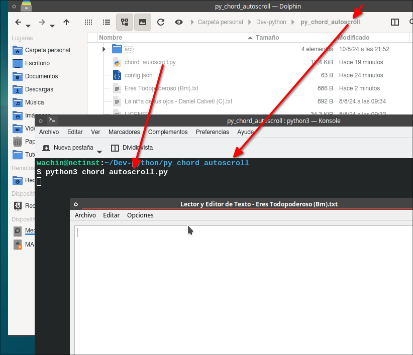
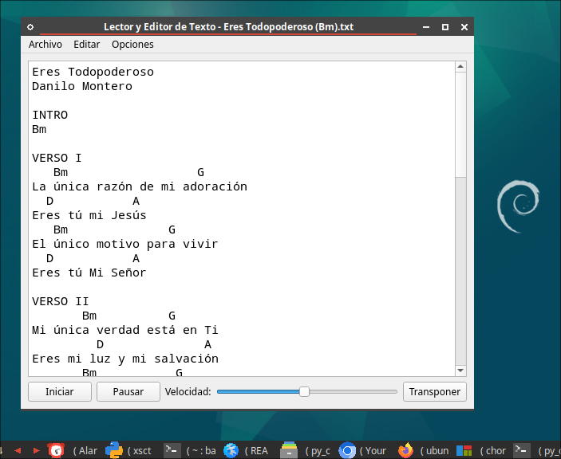
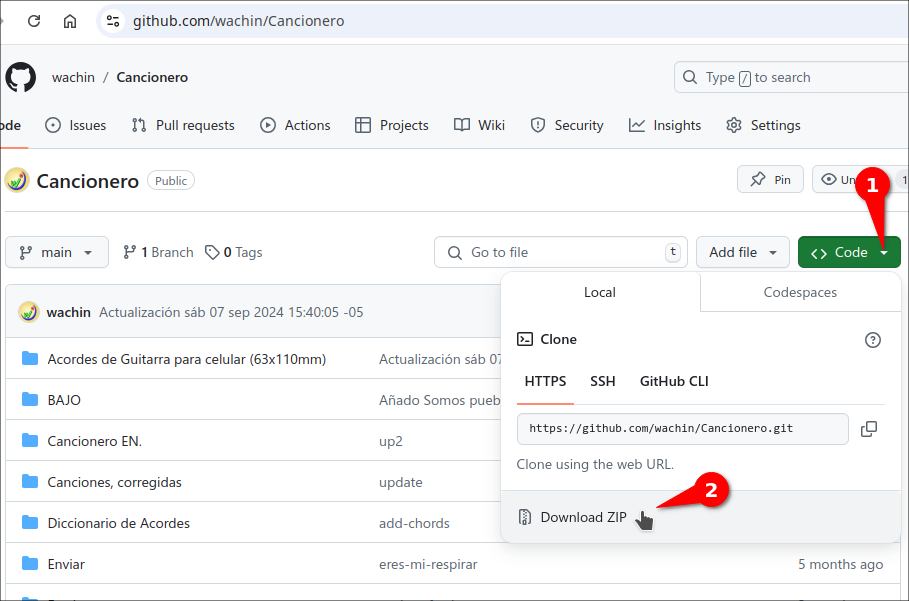

### Manual de Instalación y Uso del Programa para Guitarristas en Linux Debian 12, MX Linux 23, antiX 23

Este programa es ideal para guitarristas que necesitan gestionar archivos de canciones y ajustar los acordes rápidamente durante ensayos o presentaciones. Con características de auto-scroll y transposición, tendrás todas las herramientas necesarias a tu disposición.

Este manual está diseñado para guiar a guitarristas en la instalación y uso del programa de auto-scroll y transposición de acordes en Linux Debian 12, MX Linux 23. Con este programa, podrás cargar tus canciones con acordes, transportarlos fácilmente y desplazarte automáticamente por el texto, ¡perfecto para tus ensayos!

**Nota:** Es posible funcione en Ubuntu 24.04, Linux Mint y otros.

---

## **Instrucciones de Instalación**

### 1. **Instalación de dependencias**
Antes de ejecutar el programa, necesitas asegurarte de que ciertos paquetes estén instalados en tu sistema. Ejecuta el siguiente comando en la terminal para instalar las dependencias necesarias:

**Para Debian 12 (ejemplo MX Linux 23, antiX 23, etc)**

```bash
sudo apt-get install python3 python3-pyqt6 python3-mpmath python3-simplejson python3-all-dev fonts-noto-mono
```

### 2. **Ejecutar el programa**
Una vez instaladas las dependencias, puedes ejecutar el programa desde la terminal. Navega a la carpeta donde se encuentra el archivo `chord_autoscroll.py` y usa el siguiente comando:

Para Debian 12:

```bash
python3 chord_autoscroll_debian_12.py
```

así como en la siguiente captura de pantalla:



---

## Modo de Uso

### 1. **Abrir canciones**
Existen dos maneras de cargar tus archivos de texto con acordes en el programa:
- **Arrastrar y soltar archivos**: Simplemente arrastra un archivo de texto (con extensión `.txt`) hacia la ventana del programa.
- **Abrir desde el menú**: Haz clic en "Archivo > Abrir" en la barra de menú para seleccionar y cargar tus archivos.

**Ejemplos de archivos incluidos:**

- *La niña de tus ojos - Daniel Calveti (C).txt*
- *Sana nuestra tierra - Marcos W. (F).txt*
- *Sananos - Marcos W. (D).txt*
- *Eres Todopoderoso (Bm).txt*



### 2. **Transponer acordes**
El programa cuenta con un botón **"Transponer"**, ubicado en la esquina inferior derecha. Al hacer clic, se abrirá un menú donde puedes ajustar los semitonos de tus acordes:
- **Subir semitonos**: Desplázate hacia arriba para aumentar el tono.
- **Bajar semitonos**: Desplázate hacia abajo para reducir el tono.

Esto es especialmente útil cuando necesitas adaptar una canción a tu voz o a la afinación de tu guitarra.

### 3. **Control de desplazamiento**
El programa te permite desplazarte automáticamente por la letra y acordes de la canción, facilitando la lectura durante la interpretación.

- **Iniciar/Pausar desplazamiento**: Usa los botones **"Iniciar"** y **"Pausar"** para controlar el desplazamiento automático.
- **Ajustar velocidad**: Usa el deslizador de velocidad para ajustar la rapidez del desplazamiento según tu necesidad.

### 4. **Cambiar fuente**
El programa ofrece la posibilidad de personalizar la fuente de los acordes. En el menú "Opciones > Cambiar fuente", puedes seleccionar la fuente de tu preferencia. Por defecto, se utiliza una fuente monoespaciada **Noto Mono**, perfecta para asegurar la correcta alineación de los acordes.

### 5. **Cambiar y guardar la velocidad de desplazamiento**
El programa ofrece la posibilidad de cambiar la velociad. En el menú "Opciones > Cambiar velocidad máxima", puedes seleccionar puedes aumentar el número que allí aparece lo que hará que la velocidad de desplazamiento sea más baja, esto funciona bien en Sistemas Operativos Debian 12 y basados en el como MX Linux 23, antiX 23, etc

---

### 5. He hecho un Cancionero con muchas alabanzas que usamos en la Iglesia

 En la siguiente dirección está mi cancionero con letras y acordes de guitarra:

[https://github.com/wachin/Cancionero](https://github.com/wachin/Cancionero)

lo puedes descargar así:



si eres desarrollador puedes Clonarlo, también crear un Fork.

Las canciones están en la carpeta:

/Acordes de Guitarra para celular (63x110mm)

y debes instalar la siguiente fuente tipográfica que la dejé allí mismo:

/Cancionero/Fonts/iosevka-wps-linux/

Para editar los archivos .docx puedes usar LibreOffice, WPS Office, Microsoft Windows (si lo tenga instalado en Wine o PlayOnLinux)

Le dejo los siguientes temas importantes que he escrito en mi Blog:

[Instalar fuentes tipográficas de Windows en Linux(Ubuntu, Debian, Fedora, etc) para compatibilidad de archivos de Midrosoft Office en LibreOffice, WPS Office](https://facilitarelsoftwarelibre.blogspot.com/2018/11/instalar-fuentes-de-windows-en.html)

[Cómo instalar fuentes tipográficas descargadas desde Internet en Linux + Análisis de las fuentes de los repositorios de Debian, Ubuntu: Ibm, Noto, Liberation, Dejavu, Bitstream Vera , Freefont](https://facilitarelsoftwarelibre.blogspot.com/2021/01/como-instalar-fuentes-tipograficas-en-linux.html)

[Fuentes monoespaciadas (mono fonts) en WPS Office no están alineadas](https://facilitarelsoftwarelibre.blogspot.com/2022/05/problema-con-las-fuentes-monoespaciadas.html)

También revise el diccionario de acordes:

/Cancionero/Diccionario de Acordes/

---

## Atajos Asignados  
Los siguientes son los atajos de teclado que le he puesto:

| Función                  | Atajo         |
|--------------------------|---------------|
| Nuevo archivo            | `Ctrl+N`      |
| Abrir archivo            | `Ctrl+O`      |
| Guardar archivo          | `Ctrl+S`      |
| Guardar como             | `Ctrl+Shift+S`|
| Salir                    | `Ctrl+Q`      |
| Seleccionar todo          | `Ctrl+A`      |
| Cambiar fuente           | `Ctrl+F`      |
| Cambiar velocidad máxima | `Ctrl+Shift+V`|
| Acerca de                | `Ctrl+H`      |
| Deshacer	| Ctrl+Z |
| Rehacer	| Ctrl+Shift+Z |

---

### **Notas sobre las dependencias:**

Si encuentras que falta alguna dependencia en tu sistema (esto lo podrías ver cuando abras el programa desde la terminal), puedes agregarla mediante el comando `apt-get` de forma similar. El programa depende principalmente de **Python 3**, **PyQt6** y algunas bibliotecas adicionales para manejo de fuentes y archivos.

---

Que Dios les bendiga
