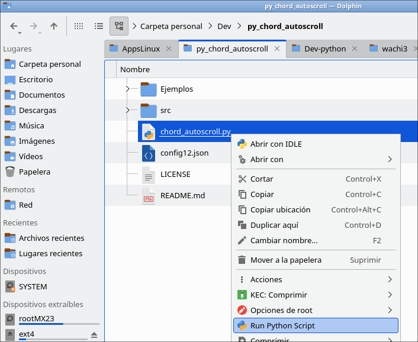

# Manual de Instalación y Uso del Programa para Guitarristas en Linux Debian 12, MX Linux 23, antiX 23

Este programa es ideal para guitarristas que necesitan gestionar archivos de canciones en formato de texto .txt y ajustar los acordes rápidamente durante ensayos. Con características de auto-scroll y transposición, tendrás todas las herramientas necesarias a tu disposición para poder adaptar una canción para tu voz.

## Probado en los siguientes Linux:
- Linux Debian 12 de 32 bit
- MX Linux 23 de 32 y 64 bit


---

# Instrucciones de Instalación

## 1. Instalación de dependencias
Antes de ejecutar el programa, necesitas asegurarte de que ciertos paquetes estén instalados en tu sistema. Ejecuta el siguiente comando en la terminal para instalar las dependencias necesarias:

**Para Debian 12, MX Linux 23, antiX 23)**

```bash
sudo apt-get install python3 python3-pyqt6 python3-mpmath \
    python3-simplejson python3-all-dev qt6-translations-l10n \
    fonts-noto-mono python3-chardet
```

**Nota:** Al final dejo explicaciones de para qué sirven algunos de estos paquetes.

---

## 2. Ejecutar el programa
Una vez instaladas las dependencias, puedes ejecutar el programa desde la terminal. Navega a la carpeta donde se encuentra el archivo `chord_autoscroll.py` y usa el siguiente comando:

Para Debian 12:

```bash
python3 chord_autoscroll.py
```

así como en la siguiente captura de pantalla:


o si tu Distribución Linux cuenta con un lanzador de programas escritos en python como en MX Linux 23 con clic derecho en Thunar, o si deseas hacerlo en Dolphin instala mi [lanzador](https://facilitarelsoftwarelibre.blogspot.com/2024/08/anadir-dolphin-una-opcion-para-ejecutar-scrpts-en-python.html):




---

## Modo de Uso

### 1. Abrir canciones
Existen dos maneras de cargar tus archivos de texto con acordes en el programa:
- **Arrastrar y soltar archivos**: Simplemente arrastra un archivo de texto (con extensión `.txt`) hacia la ventana del programa.
- **Abrir desde el menú**: Haz clic en "Archivo > Abrir" en la barra de menú para seleccionar y cargar tus archivos.

**Ejemplos de archivos incluidos:**

🗀 Ejemplos/A quien iré - Luis Enrrique Espinosa (C).txt  
🗀 Ejemplos/A quien iré - Luis Enrrique Espinosa (D).txt  
🗀 Ejemplos/Canta al Señor - Vertical (C#).txt  
🗀 Ejemplos/De tal manera - Abel Zabala (A#).txt  
🗀 Ejemplos/El Espíritu de Dios - Hector Pinilla (E).txt  
🗀 Ejemplos/La niña de tus ojos - Daniel Calveti (A).txt  
🗀 Ejemplos/La niña de tus ojos - Daniel Calveti (C).txt  
🗀 Ejemplos/No hay lugar mas alto - Miel San Marcos (A).txt  
🗀 Ejemplos/Renuévame - Marcos Witt (C).txt  
🗀 Ejemplos/Renuévame - Marcos Witt (D).txt  
🗀 Ejemplos/Sumergeme - Jesus A.R (A#).txt   


### 2. Transponer acordes
El programa cuenta con un botón **"Transponer"**, ubicado en la esquina inferior derecha. Al hacer clic, se abrirá un menú donde puedes ajustar los semitonos de tus acordes:
- **Subir semitonos**: Desplázate hacia arriba para aumentar el tono.
- **Bajar semitonos**: Desplázate hacia abajo para reducir el tono.

Esto es especialmente útil cuando necesitas adaptar una canción a tu voz o a la afinación de tu guitarra.

### 3. Control de desplazamiento
El programa te permite desplazarte automáticamente por la letra y acordes de la canción, facilitando la lectura durante la interpretación.

- **Iniciar/Pausar desplazamiento**: Usa los botones **"Iniciar"** y **"Pausar"** para controlar el desplazamiento automático.
- **Ajustar velocidad**: Usa el deslizador de velocidad para ajustar la rapidez del desplazamiento según tu necesidad.

### 4. Cambiar fuente
El programa ofrece la posibilidad de personalizar la fuente de los acordes. En el menú "Opciones > Cambiar fuente", puedes seleccionar la fuente de tu preferencia. Por defecto, se utiliza una fuente monoespaciada **Noto Mono**, perfecta para asegurar la correcta alineación de los acordes.

### 5. Cambiar y guardar la velocidad de desplazamiento
El programa ofrece la posibilidad de cambiar la velociad. En el menú "Opciones > Cambiar velocidad máxima", puedes seleccionar puedes aumentar el número que allí aparece lo que hará que la velocidad de desplazamiento sea más baja, esto funciona bien en Sistemas Operativos Debian 12 y basados en el como MX Linux 23, antiX 23, etc

---

### 6. Opciones de guardado de archivos

El programa incluye tres opciones para guardar archivos en el menú "Archivo":

**1. Guardar**

Esta opción guarda el archivo utilizando la misma codificación y terminador de línea que tenía originalmente el archivo abierto o editado. Es útil para conservar la compatibilidad con otros programas o sistemas.

**2. Guardar como...**

Permite guardar el archivo en una nueva ubicación, pero conserva la codificación y el terminador de línea originales del archivo abierto o editado. No muestra opciones para cambiar la codificación.

**3. Guardar Codificación como...**

Esta opción te permite guardar el archivo seleccionando una codificación y terminador de línea diferentes. Al elegir esta opción, aparecerá un cuadro de diálogo donde puedes seleccionar entre las siguientes codificaciones:

* **UTF-8**
 
* **UTF-16 LE**
 
* **UTF-16 BE**
 
* **UTF-8 con BOM**
 
* **ANSI**

* **ISO-8859-1**

Y también puedes seleccionar el tipo de terminador de línea:

* **Windows (CRLF)**

* **Unix (LF)**

* **Mac (CR)**

Esto es especialmente útil si necesitas que el archivo sea compatible con diferentes sistemas operativos o programas que requieren una codificación específica.


### 7. He hecho un Cancionero con muchas alabanzas que usamos en la Iglesia

 En la siguiente dirección está mi cancionero con letras y acordes de guitarra:

[https://github.com/wachin/Cancionero](https://github.com/wachin/Cancionero)

lo puedes descargar así:


Las canciones están en la carpeta:  


🗀 Acordes de Guitarra para celular (63x110mm)


y debes instalar la siguiente fuente tipográfica que la dejé allí mismo para varias canciones que uso:


🗀 Cancionero/Fonts/iosevka-wps-linux/  


allí están las instrucciones de instalación. Aunque ultimamente he llegado a la conclusión que para las nuevas usaré la fuente de Microsoft llama Consolas pues pensando en los usuarios de Windows que usan Microsoft Office Word, y además para usarlas online en [https://www.office.com/](https://www.office.com/)

Para editar los archivos .docx puedes usar LibreOffice, WPS Office, Microsoft Windows (si lo tenga instalado en Wine o PlayOnLinux)

---

#### Temas sobre instalación de fuentes tipográficas
Le dejo los siguientes temas importantes que he escrito sobre las fuentes tipográficas en mi Blog:

**Instalar fuentes tipográficas de Windows en Linux(Ubuntu, Debian, Fedora, etc) para compatibilidad de archivos de Midrosoft Office en LibreOffice, WPS Office**  
[https://facilitarelsoftwarelibre.blogspot.com/2018/11/instalar-fuentes-de-windows-en.html](https://facilitarelsoftwarelibre.blogspot.com/2018/11/instalar-fuentes-de-windows-en.html)


**Cómo instalar fuentes tipográficas descargadas desde Internet en Linux + Análisis de las fuentes de los repositorios de Debian, Ubuntu: Ibm, Noto, Liberation, Dejavu, Bitstream Vera , Freefont**  
[https://facilitarelsoftwarelibre.blogspot.com/2021/01/como-instalar-fuentes-tipograficas-en-linux.html](https://facilitarelsoftwarelibre.blogspot.com/2021/01/como-instalar-fuentes-tipograficas-en-linux.html)

**Fuentes monoespaciadas (mono fonts) en WPS Office no están alineadas**  
[https://facilitarelsoftwarelibre.blogspot.com/2022/05/problema-con-las-fuentes-monoespaciadas.html](https://facilitarelsoftwarelibre.blogspot.com/2022/05/problema-con-las-fuentes-monoespaciadas.html)

---

## Atajos Asignados  
Los siguientes son los atajos de teclado que le he puesto:

|         Función          |          Atajo           |
| ------------------------ | ------------------------ |
| Nuevo archivo            | `Ctrl+N`                 |
| Abrir archivo            | `Ctrl+O`                 |
| Guardar archivo          | `Ctrl+S`                 |
| Guardar como             | `Ctrl+Shift+S`           |
| Salir                    | `Ctrl+Q`                 |
| Seleccionar todo         | `Ctrl+A`                 |
| Cambiar fuente           | `Ctrl+F`                 |
| Cambiar velocidad máxima | `Ctrl+Shift+V`           |
| Acerca de                | `Ctrl+H`                 |
| Deshacer	               | `Ctrl+Z`                 |
| Rehacer	               | `Ctrl+Shift+Z`           |
| Iniciar Scroll	       | `Ctrl+Barra espaciadora` |
| Pausar Scroll	           | `Ctrl+Barra espaciadora` |

---

## Notas sobre las dependencias:
Explicación de para qué sirve cada una de las dependencias instaladas 😊:

---

### 1. `python3`
   - **Descripción:** Instala el intérprete de Python 3.
   - **Función:** Es la base para ejecutar programas escritos en Python.

---

### 2. `python3-pyqt6`
   - **Descripción:** Es un conjunto de enlaces de Python para Qt 6, una biblioteca popular para crear interfaces gráficas.
   - **Función:** Proporciona los componentes gráficos (ventanas, botones, menús, etc.) que se utilizan en el programa.
   - **Ejemplo:** Permite crear ventanas principales, pestañas, etiquetas, y controles como el botón de "Iniciar" o la barra de desplazamiento.

---

### 3. `python3-mpmath`
   - **Descripción:** Biblioteca para cálculos matemáticos con precisión arbitraria.
---

### 4. `python3-simplejson`
   - **Descripción:** Biblioteca para trabajar con datos en formato JSON (JavaScript Object Notation).
   - **Función:** Facilita la lectura y escritura de archivos de configuración o datos estructurados en JSON. Sirve para guardar configuraciones como la fuente, velocidad de desplazamiento, o preferencias del usuario.

---

### 5. `python3-all-dev`
   - **Descripción:** Incluye archivos de desarrollo para Python 3, como cabeceras y herramientas necesarias para compilar extensiones en C/C++.
   - **Función:** Es útil si necesitas compilar bibliotecas adicionales o trabajar en el desarrollo de módulos personalizados para Python.

---

### 6. `fonts-noto-mono`
   - **Descripción:** Es un conjunto de fuentes monoespaciadas de alta calidad de la familia Noto.
   - **Función:** Proporciona una fuente monoespaciada (usada comúnmente en editores de texto y código) para mostrar contenido de manera clara y legible. Es la fuente predeterminada para mostrar letras y acordes en el editor de texto.

---

### 7. `python3-chardet`
   - **Descripción:** Biblioteca para detectar la codificación de archivos de texto.
   - **Función:** Permite que el programa identifique automáticamente la codificación de un archivo al abrirlo, asegurando que pueda manejar archivos en formatos como UTF-8, ISO-8859-1, o Windows-1252, y otros.

### 8. `qt6-translations-l10n`
El paquete `qt6-translations-l10n` en Debian 12 proporciona archivos de traducción para la biblioteca Qt6, lo que significa que añade soporte para múltiples idiomas en las aplicaciones desarrolladas con Qt6, incluyendo el español, entre otros idiomas.

Qt es un framework ampliamente utilizado para crear interfaces gráficas de usuario (GUI) y aplicaciones multiplataforma. Los cuadros de diálogo como "Abrir", "Guardar como", y otros mensajes de sistema que ves en el editor en Python se generan mediante la interfaz de Qt, y esos mensajes pueden estar traducidos dependiendo de la configuración de idioma del sistema.

**Función del paquete `qt6-translations-l10n`:**
- **Traducción de la interfaz**: Cuando instalas el paquete `qt6-translations-l10n`, estás proporcionando las traducciones necesarias para que los elementos de la interfaz de Qt, como los diálogos de archivo, botones, menús, etc., aparezcan en el idioma configurado en tu sistema (en este caso, español).

La parte del código agregado para que funcione esto es:

```
import sys
import os
import math

# Resto del código

from PyQt6.QtCore import Qt, QTimer, QUrl, QTranslator, QLocale, QLibraryInfo

    # Resto del código

    def __init__(self):
        super().__init__()
        self.translator = QTranslator()

        translations_path = QLibraryInfo.path(QLibraryInfo.LibraryPath.TranslationsPath)
        print(f"Ruta de traducciones: {translations_path}")  # Depuración

        # Cargar traducción al español
        if self.translator.load("qtbase_es", translations_path):
            QApplication.installTranslator(self.translator)
            print("Traducción al español cargada correctamente.")
        else:
            print("No se pudo cargar la traducción al español.")
            
    # Resto del código
```

---

Que Dios les bendiga
